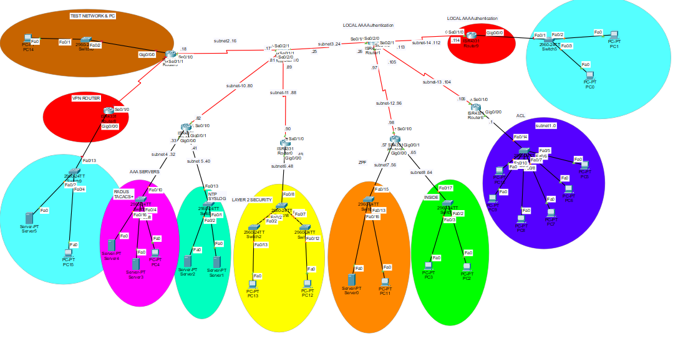

# Multi-Site-NetSec-Infrastructure
Advanced-Cisco-Network-Security-Project

# Secure Enterprise Network Infrastructure Design

## 📌 Project Overview
This project demonstrates the design and implementation of a secure, scalable enterprise network using **Cisco Packet Tracer**. The network consists of 8 routers and 18 subnets, featuring advanced routing and multi-layered security protocols.

## 🚀 Key Features & Technologies
- **Routing:** Dynamic routing using **OSPF** (Open Shortest Path First) with MD5 Authentication for secure updates.
- **Security:** - **Zone-Based Policy Firewall (ZPF):** Defined Inside, Outside, and DMZ zones.
  - **Site-to-Site VPN (IPsec):** Encrypted communication between two remote sites.
  - **ACLs:** Granular Access Control Lists for ICMP, SSH, and HTTP traffic.
  - **AAA:** Authentication via **RADIUS** and **TACACS+** with local fallback.
- **Switching:** VLAN segmentation (Management & Data) and Layer 2 Security (Port Security).
- **Services:** Centralized **Syslog** and **NTP** for network monitoring and synchronization.

## 📊 Network Topology

## 🔢 IP Addressing Scheme (Subnetting)
The network is based on the `192.168.1.0/24` range, divided into 18 subnets to optimize address space:

| Subnet # | Name | Network ID | Mask | Purpose |
| :--- | :--- | :--- | :--- | :--- |
| 1 | ACL Network | 192.168.1.0/28 | 255.255.255.240 | High Security LAN |
| 2-18 | Various | 192.168.1.x/29 | 255.255.255.248 | Serial Links & Small LANs |

## 🛠️ Configuration Highlights
Detailed configurations for OSPF, VPN, and ZPF can be found in the running configuration of the `.pkt` file.

## 📂 Files Included
- `NTI_Final_Project.pkt`: The main Cisco Packet Tracer file.
- `/images`: Screenshots of connectivity tests (Pings) and configurations.
